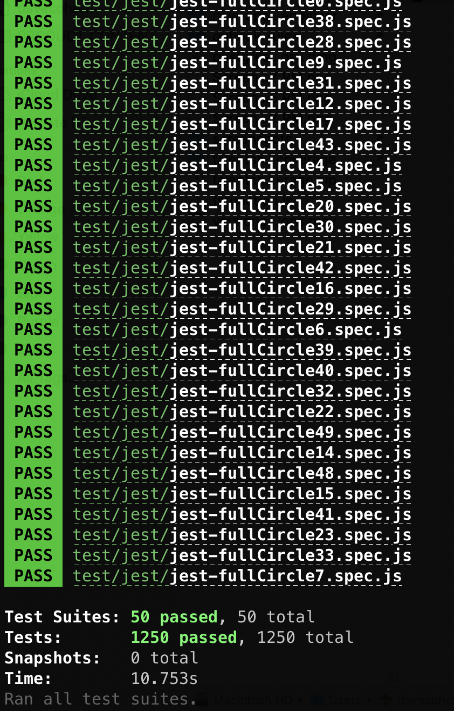
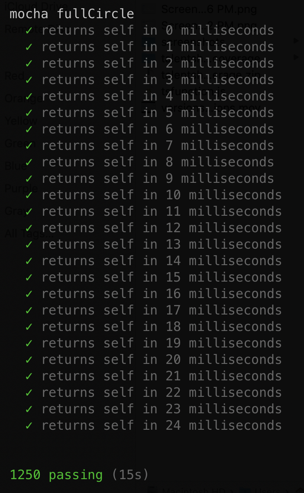
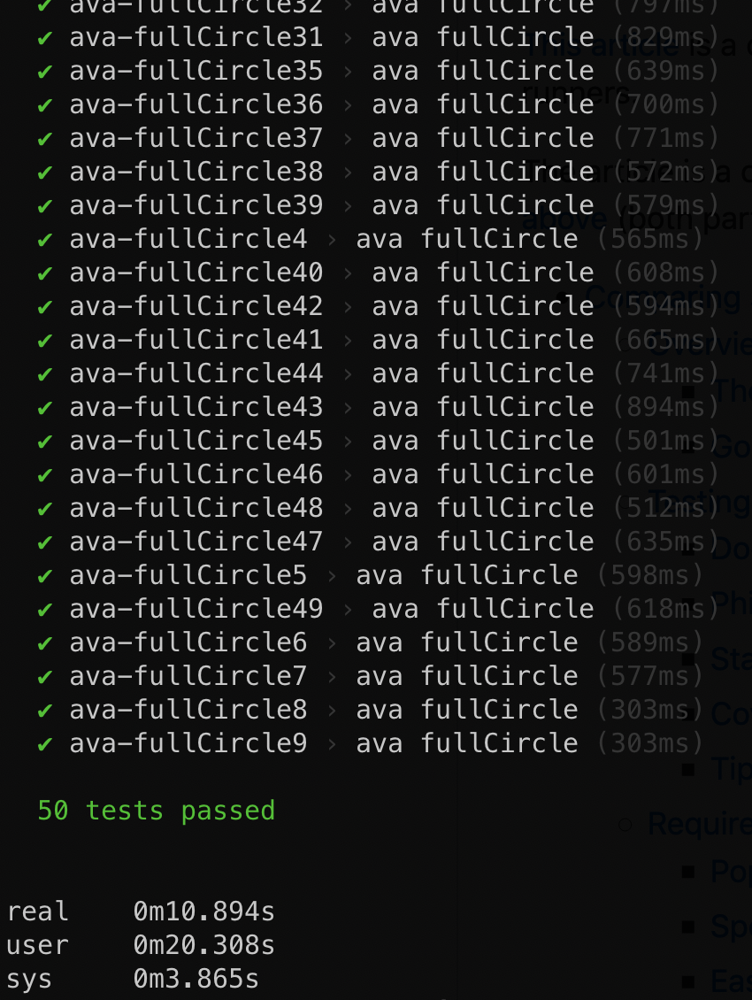

# Comparing JavaScript Test Runners


[This article](https://github.com/scraggo/comparing-javascript-test-runners/blob/master/comparing-javascript-test-runners.md) is a comparison of the AVA, Jest, Mocha (along with the Mocha wrapper `mocha-parallel-tests`) JavaScript test runners.

The article is a companion to [a node application that has the capability of creating and running tests in the frameworks listed above](https://github.com/scraggo/comparing-javascript-test-runners) (both part of the <https://github.com/scraggo/comparing-javascript-test-runners>
repo.)

- [Comparing JavaScript Test Runners](#comparing-javascript-test-runners)
  - [Overview](#overview)
    - [The Problem](#the-problem)
    - [Goals](#goals)
  - [Testing in general](#testing-in-general)
    - [Documentation: writing tests that outline the functionality of the application](#documentation-writing-tests-that-outline-the-functionality-of-the-application)
    - [Philosophy: "What" should we test? What level of "granularity" are we aiming for?](#philosophy-%22what%22-should-we-test-what-level-of-%22granularity%22-are-we-aiming-for)
    - [State: the pros and cons of sharing state between tests](#state-the-pros-and-cons-of-sharing-state-between-tests)
    - [Coverage: the extent to which one should measure test coverage](#coverage-the-extent-to-which-one-should-measure-test-coverage)
    - [Tips](#tips)
  - [Requirements](#requirements)
    - [Popularity and Community](#popularity-and-community)
    - [Speed](#speed)
    - [Ease of Use](#ease-of-use)
    - [Failure Reporting and Debugging](#failure-reporting-and-debugging)
    - [Works with your framework and environment of choice (React, Redux, Electron, etc)](#works-with-your-framework-and-environment-of-choice-react-redux-electron-etc)
    - [Nice to Have](#nice-to-have)
  - [Comparing the Test Runners](#comparing-the-test-runners)
    - [AVA](#ava)
    - [Jest](#jest)
    - [Mocha](#mocha)
    - [mocha-parallel-tests](#mocha-parallel-tests)
    - [Popularity and Community Comparison](#popularity-and-community-comparison)
    - [Speed Comparison](#speed-comparison)
      - [What do "serial" and "parallel" mean?](#what-do-%22serial%22-and-%22parallel%22-mean)
      - [Benchmarks](#benchmarks)
    - [Ease of Use Comparison](#ease-of-use-comparison)
    - [Amount of necessary configuration/dependencies](#amount-of-necessary-configurationdependencies)
      - [Writing the tests](#writing-the-tests)
      - [Running the tests](#running-the-tests)
    - [Failure Reporting and Debugging Comparison](#failure-reporting-and-debugging-comparison)
    - [Works with your framework and environment of choice (React, Redux, Electron, etc) Comparison](#works-with-your-framework-and-environment-of-choice-react-redux-electron-etc-comparison)
    - [Full Comparison (with "Nice to Haves")](#full-comparison-with-%22nice-to-haves%22)
  - [Conclusion](#conclusion)
    - [External Resources](#external-resources)

## Overview

### The Problem

Technology is always changing. As a result, the popular frameworks of today may become unpopular tomorrow. Despite this, we can assume that code should be tested and there are general principles we can adhere to.

In recent years, JavaScript has become a more robust language thanks to the steady cadence of enhancements starting with ES6/2015. As a result, many front-end frameworks can accomplish the task of creating serious web applications. In general, these frameworks are much easier to test than frameworks of years past. Three test runners have risen far above the rest as the most popular choices:

- AVA <https://github.com/avajs/ava>
- Jest <https://jestjs.io/>
- Mocha <https://mochajs.org/>
  - and an interesting wrapper called mocha-parallel-tests <https://github.com/mocha-parallel/mocha-parallel-tests>

### Goals

The immediate practical goal of this article is to help you choose a JavaScript testing framework. (Note: I'll be using "test runner" and "testing framework" interchangeably.) My aim is to address the following questions:

**How does one choose the right testing framework for their use case? What criteria should one base their decision on?**

In order to do this, we'll explore some general principles regarding both testing frameworks and testing in general. Then, after outlining the criteria for evaluating the frameworks, we can explore them in detail.

## Testing in general

There are differing opinions on what the "best practices" are for testing code. I have a pragmatic opinion - we should test what is necessary to gain confidence that our application is running correctly and we should do it in a way that leverages existing tools that have been refined and are trusted by the developer community.

The general principles I think are important are:

### Documentation: writing tests that outline the functionality of the application

- A test description should be simple to understand. Written in this way, the tests are another form of documentation for the source code. A product owner should be able to read through the tests and understand their relation to the application as a whole.
- In the case of testing abstractions, we should take time to be even clearer about the utility of such a test.

### Philosophy: "What" should we test? What level of "granularity" are we aiming for?

- A unit test has the smallest scope of the test types. What may be under test is a function or a class.
- An integration test has a wider scope than a unit test. This sort of test combines individual units and tests them as a group with the aim of assuring that they run correctly when interacting with each other. (We want to avoid is the scenario where units work perfectly in isolation, but not together.)
- An acceptance test (a.k.a. end to end test) has the widest scope. It's goal is to test as an end user would use the application without directly calling source code.
- When in doubt:
  - It should be clear where unit, integration, and acceptance tests are.
  - Think of the unit under test as a "black box" whenever possible. The goal should be to test the _behavior_ of the unit, not how it's implemented.
  - Don't test external library code. We should be using high-quality libraries that have their own test suites.

### State: the pros and cons of sharing state between tests

- Ideally, one doesn't share state between tests, period. Test suites (a file that contains test blocks) should definitely aim to steer clear of shared state. Individual test blocks should have a clean version of the unit under test.
- In a few cases, shared setup between test blocks may be necessary. An example of this is when we're making assertions during an end-to-end test that has many steps.

### Coverage: the extent to which one should measure test coverage

- Using test coverage tools gives us a metric for how many lines, statements, or blocks of your code are tested. Your team may decide that 100% test coverage is necessary. My feeling is that you should cover all _essential_ functions, the goal being that after changing code, your tests will fail if your changes affected anything that it could have affected.
- Another "metric" that I like to use while reviewing code is analyzing the changes for the big picture: Do the tests cover what was in the "acceptance criteria" of the task?

### Tips

- Learn more about testing by reading the test specs of a well-written library.
- Is an external library under-documented? Read through the test-suites to get a quick view into how it works. (Reading the open and closed issues may be helpful too.)

## Requirements

Now that we've outlined some testing concepts, we can dive into what we'll require from a test framework.

### Popularity and Community

A testing framework should have community support. An unpopular framework may be out of date or may not have the kinks ironed out. It might have incomplete documentation (including stack overflow questions.) It might not have enough developers working on it to fix its issues.

### Speed

A testing framework should not be slow. We can only define this _relatively_ - for one person's _slow_ may be another person's _acceptable_. We will be benchmarking speed for all the frameworks.

### Ease of Use

A testing framework should be un-difficult to use. The setup, configuration, command-line options, and test writing itself should be _relatively_ straightforward. If it's too confusing to a developer to use, it will be less likely that tests will get written.

### Failure Reporting and Debugging

A testing framework should give ample information when a particular test fails. We should know exactly which test failed and the stack trace of the unit being called. We should also be able to put breakpoints in with our favorite debugging tools.

### Works with your framework and environment of choice (React, Redux, Electron, etc)

A testing framework must be compatible with what you're trying to test. It should be flexible enough to be able to adapt to the changing needs of those frameworks.

- Ability to run in multiple environments: `node`, in-browser, CI/CD
- Versatility to run unit, integration, and end-to-end tests.

### Nice to Have

Depending on what you need to test, a framework should support:

- Organization strategies: `describe` blocks, `it` blocks
- "watch" and "inspect" modes
- A variety of assertion capabilities
- Ability to add tools like coverage (`nyc`), snapshot testing, etc.
- Mocking / Injecting modules (intercepting require statements)
- Webpack compilation (injecting of webpack-defined global variables)
  - simulating a CICD build step
- Babel transpilation of ESNext code
  - Use of alias module import statements (removing the need for `../../`)

## Comparing the Test Runners

Now, onto comparing the test runners themselves. Here's an overview of each one:

### AVA


<https://github.com/avajs/ava>

The magic of AVA is in its simplicity. It's minimal, fast, concurrent, and has a simple syntax that entirely removes the use of globals (like `describe`, `it`, etc.) It supports asynchronous behavior out of the box. AVA has a small team of three developers, one being open-source heavyweight `@sindresorhus`. Some other selling points directly from their readme:

> AVA is a test runner for Node.js with a concise API, detailed error output, embrace of new language features and process isolation that let you write tests more effectively.

> AVA adds code excerpts and clean diffs for actual and expected values. If values in the assertion are objects or arrays, only a diff is displayed, to remove the noise and focus on the problem.

> AVA automatically removes unrelated lines in stack traces, allowing you to find the source of an error much faster, as seen above.

> AVA automatically detects whether your CI environment supports parallel builds. Each build will run a subset of all test files, while still making sure all tests get executed. See the ci-parallel-vars package for a list of supported CI environments.

### Jest


<https://jestjs.io/>

Jest is feature-packed, aiming to solve _everything_ in one package, with a focus on making the experience delightful for the test author. It's written and maintained by Facebook and is extremely popular and community supported due to the ubiquity of React and `create-react-app`. The CLI output is colorful and interactive with detailed exception reporting and diffing. Snapshot testing, mocking, and coverage reporting are all built-in. Also included are globals like `it` and `describe` as well as a custom assertion library (similar to `chai`). It also touts:

> zero config - Jest aims to work out of the box, config free, on most JavaScript projects.

> isolated - Tests are parallelized by running them in their own processes to maximize performance.

> great api - From `it` to `expect` - Jest has the entire toolkit in one place. Well documented, well maintained, well good.

### Mocha


<https://mochajs.org/>

Being the most established of the testing frameworks, Mocha enjoys a solid place in the JavaScript community. It's been around since 2011 and is maintained by the OpenJS Foundation and contributors. Mocha supports numerous command-line options and configurations. It's generally used in tandem with external libraries - `assert` or `chai` could take care of your assertion needs and `sinon` could take care of your mocking needs. The `it` and `describe` blocks mentioned by Jest were pioneered by Mocha (along with the `beforeEach`, `afterEach`, and other pre/post hooks). In addition to being able to run in `node`, you can also run tests in the browser giving you full access to the DOM. There's also a dizzying array of test reporting styles (one being Nyan cat.) In its own words:

> Mocha is a feature-rich JavaScript test framework running on Node.js and in the browser, making asynchronous testing simple and fun. Mocha tests run serially, allowing for flexible and accurate reporting, while mapping uncaught exceptions to the correct test cases.

> Mocha is the most-depended-upon module on npm (source: libraries.io)

> The SuperAgent request library test documentation was generated with Mocha's doc reporter

### mocha-parallel-tests

<https://github.com/mocha-parallel/mocha-parallel-tests>

`mocha-parallel-tests` is not a testing framework. It's a wrapper over Mocha designed to significantly speed it up. It's new in 2019 and has a small team. I'll go into detail on why I'm including it here (and what "parallel" means) in the "speed" portion of this article. From the readme:

> `mocha-parallel-tests` is a test runner for tests written with mocha testing framework which allows you to run them in parallel.

> `mocha-parallel-tests` executes each of your test files in a separate process while maintaining the output structure of mocha.

> Compared to the other tools which try to parallelize mocha tests execution, `mocha-parallel-tests` doesn't require you to write the code in a different way or use some specific APIs - just run your tests with `mocha-parallel-tests` instead of mocha and you will see the difference. Or if you prefer to use mocha programmatic API replace it with `mocha-parallel-tests` default export and you're done!

> If you're using Node.JS >= 12 your tests execution will be even faster because `mocha-parallel-tests` supports running tests with Node.JS worker threads API.

### Popularity and Community Comparison

Now that we know a bit about each framework, lets look at the popularity and publish frequency of each one.

|                      | Weekly Downloads | Last Publish |
| -------------------- | ---------------- | ------------ |
| Jest                 | 7.2 million      | 2020-03-26   |
| Mocha                | 4.3 million      | 2020-03-18   |
| AVA                  | 227,179          | 2020-03-22   |
| mocha-parallel-tests | 18,097           | 2020-02-08   |

Jest is clearly the most popular framework with 7.2 million weekly downloads. It was published most recently and is updated very frequently. Its popularity can be partially attributed to the popularity of the React library. Jest is shipped with `create-react-app` and is recommended for use in React's documentation.

Mocha comes in second place with 4.3 million weekly downloads. It was the de facto standard long before Jest hit the scene and is the test runner of many, many applications.

AVA has 227,179 weekly downloads, an order of magnitude fewer than the most popular frameworks. This may be due to its (arguably niche) focus on minimalism or it having a small team that doesn't have the resources to promote the library.

`mocha-parallel-tests` has 18,097 weekly downloads and doesn't enjoy as frequent updates as the major three. It's extremely new and not a framework.

In general, more popularity brings more community involvement. The number of open and closed issues tends to increase as a result. To create a loose maintenance ratio \*metric , we divide the open issues by the total number of issues (open + closed issues):

|                      | Open Issues | Closed Issues | Total | Ratio |
| -------------------- | ----------- | ------------- | ----- | ----- |
| Mocha                | 254         | 2225          | 2479  | 10.2% |
| AVA                  | 154         | 1169          | 1323  | 11.6% |
| Jest                 | 844         | 4343          | 5187  | 16.2% |
| mocha-parallel-tests | 37          | 111           | 148   | 25.0% |

Mocha has the lowest ratio of open to closed issues, making it the most successfully maintained library. It's stability surely correlates with its longevity (and vice versa.)

AVA is 2nd place. This is quite impressive given its small team.

Jest is 3rd place. This comes as no surprise given that it has the most issues to deal with.

`mocha-parallel-tests` has the fewest number of total issues by far but the highest ratio. It doesn't have a significant financial backing like the other frameworks do.

\* Caveat: I'm assuming the open issues in these libraries aren't crippling to the core functionality of the library.

### Speed Comparison

Before we get to the comparison, I'd like to discuss a few concepts. All of the frameworks run the tests in "parallel", with the exception of Mocha, which runs its tests in "serial."

#### What do "serial" and "parallel" mean?

"Serial" - one at a time, ie - the first must complete before the second, the second must complete before the third, etc. Code _may_ run asynchronously but doesn't start a separate process. This type of processing is also known as sequential processing.

"Parallel" - happening simultaneously, ie - the first, second, third, etc can happen at the same time. Multiple tasks are completed at a time by different processes (which may different threads or literally different processors).

For all of the frameworks with parallel capabilities, only separate test files are run in parallel. `describe` and `it` blocks in a given file/suite are run serially. Given this, writing more test files and putting slow tests can be put into their own files may increase the speed of running the complete test suite.

#### Benchmarks

In the readme of this repo is an explanation of how I wrote and ran the tests. The aim was to simulate a "true" test run in a significantly sized enterprise codebase.

|                      | Speed | Type     |
| -------------------- | ----- | -------- |
| mocha-parallel-tests | 7.3s  | parallel |
| AVA                  | 9.6s  | parallel |
| Jest                 | 12.5s | parallel |
| Mocha                | 16.2s | serial   |

A caveat with all benchmarking tests: the hardware environment (the make, model, RAM, processes running, etc) will affect measured results. For this reason, we'll mostly be analyzing the speeds relative to each other.

`mocha-parallel-tests` is the clear winner in this run. AVA is close behind (and actually ran faster than `mocha-parallel-tests` in a few of the runs.) Jest is also fast, but seems to have a bit more overhead than the other two.

Mocha lags far behind the parallel runners - which is to be expected because it runs tests in serial. If speed is your most important criteria (and its drawbacks are not an issue), you'll see a 200-1000% increase in test speed using `mocha-parallel-tests` instead (depending on your machine, `node` version, and the tests themselves).

### Ease of Use Comparison

I'll split "ease of use" into a few categories:

- Amount of necessary configuration/dependencies
- Writing the tests
- Running the tests

### Amount of necessary configuration/dependencies

|                      | Configuration                             | Dependencies                      |
| -------------------- | ----------------------------------------- | --------------------------------- |
| Jest                 | Everything is included                    | built-in                          |
| AVA                  | Sensible defaults                         | externals necessary in most cases |
| Mocha                | Many, many options                        | externals always necessary        |
| mocha-parallel-tests | (Most of mocha CLI options are supported) | Mocha                             |

Jest - 1st place

Jest takes the cake in this department. Using its defaults wherever possible, you could have close to zero configuration.

> Jest's configuration can be defined in the package.json file of your project, or through a jest.config.js file or through the --config <path/to/file.js|cjs|mjs|json> option. If you'd like to use your package.json to store Jest's config, the "jest" key should be used on the top level so Jest will know how to find your settings

- Sensible defaults for finding tests `(default: [ "**/__tests__/**/*.[jt]s?(x)", "**/?(*.)+(spec|test).[jt]s?(x)" ])`
- A huge number of options
- Built-in snapshot tests, coverage reporting, mocking modules and libraries
- Excellent documentation, lots of tutorials and examples

AVA - 2nd place

- Sensible defaults for finding tests (see Jest's defaults)
- Configure in package.json, an ava.config.\* file, or another override file in the directory root
- Many CLI options
- Built-in snapshot tests
- `@ava/babel` for Babel compilation
- `@ava/typescript` for TypeScript support
- Good documentation, few tutorials and examples
- Coverage reporting, mocking modules and libraries must be imported from elsewhere

Mocha - 3rd place

> By default, mocha looks for the glob `"./test/*.js"`, so you may want to put your tests in `test/` folder. If you want to include subdirectories, pass the `--recursive` option.

- One default for finding tests (above)
- Configure in package.json or an override file
- Many, many CLI options
- Good documentation (slightly opaque and a lot to read through), lots of tutorials and examples (in and out of Mocha's docs)
- Assertions, coverage reporting, snapshot tests, mocking modules and libraries (everything) must be imported from elsewhere

mocha-parallel-tests - 4th place

> Most of mocha CLI options are supported. If you're missing some of the options support you're welcome to submit a PR: all options are applied in a same simple way.

- Run tests as you would with Mocha. See above
- Not all of Mocha's options are available

#### Writing the tests

|                              | Summary                             |
| ---------------------------- | ----------------------------------- |
| Mocha & mocha-parallel-tests | `describe` and `it` blocks          |
| Jest                         | like Mocha, but everything built in |
| AVA                          | import test context, customizable   |

Mocha's influence on test-writing is undeniable. From [Mocha's getting started section](https://mochajs.org/#getting-started), we can see how tests are organized in nested `describe` blocks that can contain any number of `it` blocks which make test assertions.

```js
const assert = require('assert');
describe('Array', function() {
  describe('#indexOf()', function() {
    it('should return -1 when the value is not present', function() {
      assert.equal([1, 2, 3].indexOf(4), -1);
    });
  });
});
```

[Chai's `expect`](https://www.chaijs.com/) is commonly used instead of assert:

```js
const { expect } = require('chai');

it('should return -1 when the value is not present', function() {
  expect([1, 2, 3].indexOf(4)).to.equal(-1);
});
```

> More Mocha test examples can be found here: <https://mochajs.org/#examples>

Jest follows Mocha's example, but everything is included (no need to use external assertion, etc libraries). A lot of the syntax is compatible with Mocha, for example - `it` can be used instead of `test`:

```js
describe('Array', function() {
  describe('#indexOf()', function() {
    test('should return -1 when the value is not present', function() {
      expect([1, 2, 3].indexOf(4)).toEqual(-1);
    });
  });
});
```

(Notice that Jest's `toEqual` is very much like chai's `to.equal`. Many of Jest's assertions are camel-cased analogues of chai's assertions.)

AVA takes a different approach to writing tests. It prides itself on not injecting globals into your tests. Everything comes from `test` and the `t` "execution context" variable in the callback:

```js
// Array-indexOf.spec.js
const test = require('ava');

test('should return -1 when the value is not present', t => {
  t.is([1, 2, 3].indexOf(4), -1);
});
```

Built-in assertions are available on the `t` object: `true`, `false`, `truthy`, `falsy`, `is`, etc. You can also create custom assertions.

Like Mocha and Jest, AVA has `before`, `beforeEach`, `after`, and `afterEach` hooks documented [here](https://github.com/avajs/ava/blob/master/docs/01-writing-tests.md#before--after-hooks). These work on a per-file basis.

AVA does not have a way to nest test blocks (an ability `describe` affords in Mocha and Jest.) [This issue](https://github.com/avajs/ava/issues/222) goes into detail on why the maintainers haven't adopted this functionality. [This article](https://stackoverflow.com/questions/41269085/why-doesnt-js-testing-library-ava-have-suites-or-any-other-groupings) has some alternatives.

An excellent [example of a single AVA test suite](https://github.com/sindresorhus/is/blob/master/test/test.ts) shows a wide range of AVA's capabilities.

Since the frameworks have drastically different styles and similar capabilities, this was difficult to rank from easiest to most difficult. AVA has a noticeable lack of organizing tests with nested `describe` blocks, but its contained API is extremely flexible. Mocha forces the user to make decisions on which libraries to use, but this makes it almost limitless in capability. Jest includes _everything_, but some of the built-in magic makes it difficult or confusing to get certain things done ( see [this issue on mocks](https://github.com/facebook/jest/issues/2567) ).

#### Running the tests

|                      | Summary                        |
| -------------------- | ------------------------------ |
| Jest                 | interactive CLI                |
| Mocha                | non-interactive CLI or browser |
| mocha-parallel-tests | Mocha's non-interactive CLI    |
| AVA                  | non-interactive CLI            |

Jest has an incredible interactive command line interface. (Using [Majestic](https://github.com/Raathigesh/majestic/) adds a web-based GUI to the experience.) There are numerous options for choosing which tests run and updating snapshots. It watches for test file changes in watch mode and _only runs the tests that have been updated_. There isn't as much of a need to use `.only` because filtering terms is a breeze in its interactive CLI. It's text output is not only a pleasure to look at, it also includes all the information you could need:

```txt
...
PASS  test/file.spec.js
...

Test Suites: 50 passed, 50 total
Tests:       1250 passed, 1250 total
Snapshots:   0 total
Time:        10.753s
Ran all test suites.
```



Mocha, being highly configurable, sometimes necessitates long and difficult to read commands to run test suites. Once this command is set, it may need to be altered to filter for files. I wind up making a lot of slightly varied package.json script commands to capture the variations I'm looking for. Once these are set, tests run smoothly and the output and diffs are informative and legible. (Also remember the wide range of output styles available.)




_Above: Mocha and mocha-parallel-tests output_

AVA is highly configurable, but doesn't include by default a few things. One is seeing the output of all the tests. Enable `verbose` to do that. Another is seeing the time it takes to execute the complete test suite. Adding `time` (a `bash` function) before the command, but it's not as immediately comprehendible - [see this issue](https://github.com/avajs/ava/pull/322). AVA's defaults are extremely minimal, so like Mocha, you may need a complex configuration to serve your needs. Filtering for tests is very similar to the other frameworks (there's a `--match, -m` command that can be repeated.)



_Refer to "real" for time taken to run all the tests_

### Failure Reporting and Debugging Comparison

All of the frameworks have pleasant to read output, detailed informative diffs for failures, and stack traces that show exactly where errors occurred. They all also offer the ability to debug with node or debugger of your choice. Mocha has an option to enable full stack traces, which may make it slightly more optimal for test failure troubleshooting.

Mocha

- [Debugging with node](https://mochajs.org/#-inspect-inspect-brk-inspect)
- [Enable full stack traces](https://mochajs.org/#-full-trace)

Jest

- [Troubleshooting and debugging](https://jestjs.io/docs/en/troubleshooting)

AVA

- See `debug` <https://github.com/avajs/ava/blob/master/docs/05-command-line.md>

### Works with your framework and environment of choice (React, Redux, Electron, etc) Comparison

Mocha works for everything. I've had success running React applications and end-to-end tests with Spectron (for Electron applications), amongst other things. It can also run in browser, which is extremely helpful for testing applications that use libraries which are tied directly to browser functionality.

Jest is an all-purpose test-runner and is recommended for testing React applications. It doesn't have support for browser testing (as far as I can tell.) It supports [Puppeteer](https://jestjs.io/docs/en/puppeteer) for acceptance testing (and may support others).

AVA is an all-purpose test-runner, though, it has [yet to support browser testing](https://github.com/avajs/ava/blob/master/docs/recipes/browser-testing.md). It supports [Puppeteer](https://github.com/avajs/ava/blob/master/docs/recipes/puppeteer.md) for acceptance testing (and may support others).

### Full Comparison (with "Nice to Haves")

Let's recap our findings and fill in some gaps with our "nice to haves." (MPT = `mocha-parallel-tests`)

| Feature                                                                                                       | Notes                                                                                                                                                                                                                                                  |
| ------------------------------------------------------------------------------------------------------------- | ------------------------------------------------------------------------------------------------------------------------------------------------------------------------------------------------------------------------------------------------------ |
| Popularity                                                                                                    | Jest - 1st place. Mocha - 2nd place. AVA - 3rd place. MPT - 4th place.                                                                                                                                                                                 |
| Maintenance                                                                                                   | Mocha - 1st place. AVA - 2nd place. Jest - 3rd place. MPT - 4th place.                                                                                                                                                                                 |
| Speed                                                                                                         | MPT - 1st place. AVA - 2nd place. Jest - 3rd place. Mocha - 4th place.                                                                                                                                                                                 |
| Amount of necessary configuration/dependencies                                                                | Jest - 1st place. AVA - 2nd place. Mocha - 3rd place. MPT - 4th place.                                                                                                                                                                                 |
| Organization strategies: `describe` and `it` blocks                                                           | Mocha and Jest use these, AVA does not (omits all test globals)                                                                                                                                                                                        |
| Running the tests                                                                                             | Jest - 1st place. Mocha - 2nd place. MPT - 3rd place. AVA - 4th place.                                                                                                                                                                                 |
| Failure Reporting and Debugging                                                                               | Mocha slightly above others                                                                                                                                                                                                                            |
| Works with your framework and environment of choice                                                           | Mocha wins for supporting browser testing                                                                                                                                                                                                              |
| "watch" and "inspect" modes                                                                                   | Included in all the frameworks.                                                                                                                                                                                                                        |
| A variety of assertion capabilities                                                                           | All the frameworks have these as well as the ability to add custom matchers                                                                                                                                                                            |
| Ability to add tools like coverage (nyc), snapshot testing, etc                                               | Mocha and AVA allow you to add what you need, Jest has these built-in                                                                                                                                                                                  |
| Mocking / Injecting modules (intercepting require statements)                                                 | Jest has its own module/library mocking system. Mocha and AVA require external libraries (examples: [sinon](https://sinonjs.org/), [proxyquire](https://github.com/thlorenz/proxyquire), [inject-loader](https://github.com/plasticine/inject-loader)) |
| Webpack compilation (injecting of webpack-defined global variables)                                           | For Mocha, [`mochapack`](https://sysgears.github.io/mochapack/) is a library that allows this. [Jest's docs on webpack](https://jestjs.io/docs/en/webpack.html). There's no AVA documentation for webpack specifically, see below on Babel.            |
| Babel transpilation of ESNext code and use of alias module import statements (removing the need for `../../`) | All the frameworks allow for babel configuration                                                                                                                                                                                                       |

## Conclusion

I hope this article was helpful - whether it be in furthering your own investigation, giving you a place to start with learning, or helping your team choose the right test runner for your applications. Don't hesitate to [contact me](https://www.scraggo.com/) if you have questions or feedback.

### Want to contribute?

Found a typo? Want to add details or make a correction? This repo is open-source and your contributions are 100% welcome 💥.

### External Resources

- Node.js & JavaScript Testing Best Practices (2020) - Medium: <https://medium.com/@me_37286/yoni-goldberg-javascript-nodejs-testing-best-practices-2b98924c9347>
- <https://npmcompare.com/compare/ava,jest,mocha,mocha-parallel-tests>
- <https://www.slant.co/versus/12696/12697/~mocha_vs_jest>
- <https://stackshare.io/stackups/ava-vs-mocha>
- <https://raygun.com/blog/javascript-unit-testing-frameworks/>
- <http://zpalexander.com/migrating-from-mocha-to-ava/>
